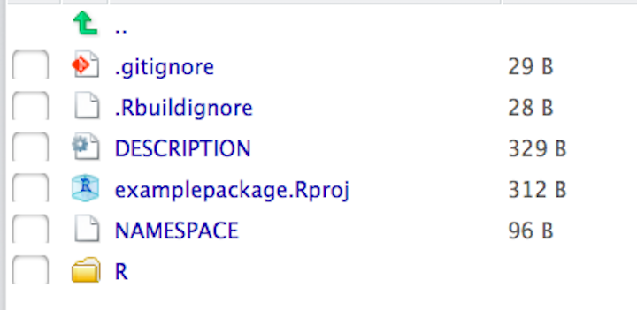

```{r}
setwd("~/Coursera/Mastering Software Development in R/3. Building R Packages")
```


# Introduction

## Welcome (Video Transcript)
So at this point we have shown people how to write their own R code and then to wrap it in into functions. And then, this is the step where we show them how to wrap those function into packages. >> Yeah, so the bottom line I think is, if you want people to actually use your code, it's gotta be in a package. Sending them a script or sending them some file that has a bunch of functions is fine. But it's not organized, there's not necessarily any documentation, there's not necessarily a tutorial of explaining how to use all these things. And so, a package is really just a mechanism for organizing your code, organizing your documentation, explaining to people how to use it. And making it really kind of friendly. >> Yeah. >> And so, it's really more about the user, and kind of providing some of the niceties that users need to kind of learn how to use your code. >> I would agree. I also think that the process of writing the documentation and putting functions together helps organize the logic for the groups of functions you're creating. >> Right, I think it also helps, you to think about what are the functions that users need and what are the functions that are just kind of in support of running the code. And so, it's kind of a natural extension of writing a function itself. Originally we started out with here's some code and then we kind of abstracted that to say here's a function and here the inputs and the outputs. And now the packages kind of natural next level where you talk about here are bunch of functions. Here, the functions that kind of like the ones that you want to call, that you need to do to accomplish specific task. >> Right, and then once you've written a package often you'll want to share it. So we're going to talk some of this about how to use GitHub to share your package and to check on other people's packages and pull them into you. >> Yeah and I think another thing were going to talk about is quality control, which is really important if you want to have a lot people using your package and to kind of maintain the quality and make that the code is always working. So we're going to talk about testing and kind of continuous integration for maintaining your packages. >> Yeah, because this builds on writing code and wrapping the code into functions this is probably going to be most comfortable, I would say for somebody who's already taken the first two courses in this specialization. >> Yeah, definitely. >> Yeah. I'm so excited the people are interested in this topic. And we're really excited that we're getting the chance to teach you how to build R packages. >> Yeah, I mean it's a really important skill, and I think that I'm just very excited to see what you can build. 


## Before you start
Building R packages requires a toolchain that must be in place before you begin developing. If you are developing packages that contain only R code, then the tools you need come with R and RStudio. However, if you want to build packages with compiled C or Fortran code (or which to build other people’s packages with such code), then you will need to install additional tools. Which tools you install depends on what platform you are running.


## Using Mac OS
For developing in Mac OS, you will first need to download the Xcode development environment. While you do not need the IDE that comes with Xcode to develop R packages you need many of the tools that come with it, including the C compiler (clang). Xcode can be obtained from either the Mac App Store (https://itunes.apple.com/us/app/xcode/id497799835?mt=12) or from Apple’s Xcode developer’s page (https://developer.apple.com/xcode/). Once this is installed you will have the C compiler as well as a number of additional Unix shell tools. You will also have necessary header files for compiling C code.

While it’s unlikely that you will be building your own packages with Fortran code, many older packages (including R itself) contain Fortran code. Therefore, in order to build these packages, you need a Fortran compiler. Mac OS does not come with on by default and so you can download the GNU Fortran Compiler (http://r.research.att.com/gfortran-4.2.3.dmg) from the R for Mac tools page.

There are more details provided on the R for Mac tools package (http://r.research.att.com/tools/) maintained by Simon Urbanek, particularly for older versions of Mac OS.


## Using Windows
On Windows, the R Core has put together a package of tools that you can download all at once and install via a simple installer tool. The Rtools package (https://cran.r-project.org/bin/windows/Rtools/) comes in different versions, depending on the version of R that you are using. Make sure to get the version of Rtools that matches your version of R. Once you have installed this, you will have most of the tools needed to build R packages. You can optionally install a few other tools, documented here (https://cran.r-project.org/bin/windows/Rtools/Rtools.txt).


## Using Unix/Linux
If you are using R on a Unix-like system then you may have already have the tools for building R packages. In particular, if you built R from the sources, then you already have a C compiler and Fortran compiler. If, however, you installed R from a package management system, then you may need to install the compilers, as well as the header files. These usually coming in packages with the suffix -devel. For example, the header files for the readline package may come in the package readline-devel. The catch is that these -devel packages are not needed to run R, only to build R packages from the sources.
Mark as completed


# R Packages

## R Packages (Overview)
An R package is a mechanism for extending the basic functionality of R. It is the natural extension of writing functions that each do a specific thing well. In the previous chapter, we discussed how writing functions abstracts the behavior of a set of R expressions by providing a defined interface, with inputs (i.e. function arguments) and outputs (i.e. return values). The use of functions simplifies things for the user because the user no longer needs to be knowledgeable of the details of the underlying code. They only need to understand the inputs and outputs.

Once one has developed many functions, it becomes natural to group them in to collections of functions that are aimed at achieving an overall goal. This collection of functions can be assembled into an R package. R packages represent another level of abstraction, where the interface presented to the user is a set of user-facing functions. These functions provide access to the underlying functionality of the package and simplify the user experience because the one does not need to be concerned with the many other helper functions that are required.

R packages are a much better way to distribute code to others because they provide a clean and uniform user experience for people who want to interact with your code. R packages require documentation in a standardized format, and the various tools that come with R (and RStudio) help to check your packages so that they do not contain inconsistencies or errors. R users are already familiar with how to use R packages, and so they will be able to quickly adopt your code if is presented in this format.

This chapter highlights the key elements of building R packages. The fine details of building a package can be found in the Writing R Extensions manual (https://cran.r-project.org/doc/manuals/r-release/R-exts.html).


## Basic Structure of an R Package
An R package begins life as a directory on your computer. This directory has a specific layout with specific files and sub-directories. The two required sub-directories are

- R, which contains all of your R code files
- man, which contains your documentation files.

At the top level of your package directory you will have a DESCRIPTION file and a NAMESPACE file. This represents the minimal requirements for an R package. Other files and sub-directories can be added and will discuss how and why in the sections below.

While RStudio is not required to build R packages, it contains a number of convenient features that make the development process easier and faster. That said, in order to use RStudio for package development, you must setup the environment properly. Details of how to do this can be found in Roger’s RStudio package development pre-flight check list (https://github.com/rdpeng/daprocedures/blob/master/lists/Rpackage_preflight.md).


## Description File
The DESCRIPTION file is an essential part of an R package because it contains key metadata for the package that is used by repositories like CRAN and by R itself. In particular, this file contains the package name, the version number, the author and maintainer contact information, the license information, as well as any dependencies on other packages.

As an example, here is the DESCRIPTION file for the mvtsplot package on CRAN. This package provides a function for plotting multivariate time series data.

<b>
Package:  mvtsplot

Version:  1.0-3

Date:  2016-05-13

Depends:  R (>= 3.0.0)

Imports: splines, graphics, grDevices, stats, RColorBrewer

Title:  Multivariate Time Series Plot

Author:  Roger D. Peng <rpeng@jhsph.edu>

Maintainer:  Roger D. Peng <rpeng@jhsph.edu>

Description:  A function for plotting multivariate time series data.

License:  GPL (>= 2)

URL: https://github.com/rdpeng/mvtsplot
</b>

## Namespace File
The NAMESPACE file specifies the interface to the package that is presented to the user. This is done via a series of export() statements, which indicate which functions in the package are exported to the user. Functions that are not exported cannot be called directly by the user (although see below). In addition to exports, the NAMESPACE file also specifies what functions or packages are imported by the package. If your package depends on functions from another package, you must import them via the NAMESPACE file.

Below is the NAMESPACE file for the mvtsplot package described above.
<b>
export("mvtsplot")

import(splines)

import(RColorBrewer)

importFrom("grDevices", "colorRampPalette", "gray")

importFrom("graphics", "abline", "axis", "box", "image", "layout",
           "lines", "par", "plot", "points", "segments", "strwidth",
           "text", "Axis")

importFrom("stats", "complete.cases", "lm", "na.exclude", "predict",
           "quantile")
</b>

Here we can see that only a single function is exported from the package (the mvtsplot() function). There are two types of import statements:

- import(), simply takes a package name as an argument, and the interpretation is that all exported functions from that external package will be accessible to your package
- importFrom(), takes a package and a series of function names as arguments. This directive allows you to specify exactly which function you need from an external package. For example, this package imports the colorRampPalette() and gray() functions from the grDevices package.

Generally speaking, it is better to use importFrom() and to be specific about which function you need from an external package. However, in some cases when you truly need almost every function in a package, it may be more efficient to simply import() the entire package.

With respect to exporting functions, it is important to think through carefully which functions you want to export. First and foremost, exported functions must be documented and supported. Users will generally expect exported functions to be there in subsequent iterations of the package. It’s usually best to limit the number of functions that you export (if possible). It’s always possible to export something later if it is needed, but removing an exported function once people have gotten used to having it available can result in upset users. Finally, exporting a long list of functions has the effect of cluttering a user’s namespace with function names that may conflict with functions from other packages. Minimizing the number of exports reduces the chances of a conflict with other packages (using more package-specific function names is another way).


## Namespace Function Notation
As you start to use many packages in R, the likelihood of two functions having the same name increases. For example, the commonly used dplyr package has a function named filter(), which is also the name of a function in the stats package. If one has both packages loaded (a more than likely scenario) how can one specific exactly which filter() function they want to call?

In R, every function has a full name, which includes the package namespace as part of the name. This format is along the lines of
```{r eval=FALSE}
<package name>::<exported function name>
```

For example, the filter() function from the dplyr package can be referenced as dplyr::filter(). This way, there is no confusion over which filter() function we are calling. While in principle every function can be referenced in this way, it can be tiresome for interactive work. However, for programming, it is often safer to reference a function using the full name if there is even a chance that there might be confusion.

It is possible to call functions that are not exported by package by using the namespace notation. The ::: operator can be used for this purpose, as in <package name>:::<unexported function name>. This can be useful for examining the code of an unexported function (e.g. for debugging purposes) or for temporarily accessing some unexported feature of a package. However, it’s not a good idea to make this a habit as such unexported functions may change or even be eliminated in future versions of the package. Furthermore, use of the ::: operator is not allowed for packages that reside on CRAN.


## Loading and attaching a package namespace
When dealing with R packages, it’s useful to understand the distinction between loading a package namespace and attaching it. When package A imports the namespace of package B, package A loads the namespace of package B in order to gain access to the exported functions of package B. However, when the namespace of package B is loaded, it is only available to package A; it is not placed on the search list and is not visible to the user or to other packages.

Attaching a package namespace places that namespace on the search list, making it visible to the user and to other packages. Sometimes this is needed because certain functions need to be made visible to the user and not just to a given package.


## The R-Subdirectory
The R sub-directory contains all of your R code, either in a single file, or in multiple files. For larger packages it’s usually best to split code up into multiple files that logically group functions together. The names of the R code files do not matter, but generally it’s not a good idea to have spaces in the file names.


## The man subdirectory
The man sub-directory contains the documentation files for all of the exported objects of a package. With older versions of R one had to write the documentation of R objects directly into the man directory using a LaTeX-style notation. However, with the development of the roxygen2 package, we no longer need to do that and can write the documentation directly into the R code files. Therefore, you will likely have little interaction with the man directory as all of the files in there will be auto-generated by the roxygen2 package.


## Summary
R packages provide a convenient and standardized mechanism for distributing R code to a wide audience. As part of building an R package you design an interface to a collection of functions that users can access to make use of the functionality you provide. R packages are directories containing R code, documentation files, package metadata, and export/import information. Exported functions are functions that are accessible by the user; imported functions are functions in other packages that are used by your package.


# The devtools Package

## The devtools package
R package development has become substantially easier in recent years with the introduction of a package by Hadley Wickham called devtools. As the package name suggests, this includes a variety of functions that facilitate software development in R. 

Hands down, the best resource for mastering the devtools package is the book R Packages by Hadley Wickham. The full book is available online for free at http://r-pkgs.had.co.nz. It is also available as a hard copy book published by O’Reilly. If you plan to develop a lot of R packages, it is well worth your time to read this book closely.

Here are some of the key functions included in devtools and what they do, roughly in the order you are likely to use them as you develop an R package:

Function | Use
--- | ---
load_all | Load the code for all functions in the package
document | Create \man documentation files and the “NAMESPACE” file from roxygen2 code
use_data | Save an object in your R session as a dataset in the package
use_vignette | Set up the package to include a vignette
use_readme_rmd | Set up the package to include a README file in Rmarkdown format
use_build_ignore | Specify files that should be ignored when building the R package (for example, if you have a folder where you’re drafting a journal article about the package, you can include all related files in a folder that you set to be ignored during the package build)
check | Check the full R package for any ERRORs, WARNINGs, or NOTEs
build_win | Build a version of the package for Windows and send it to be checked on a Windows machine. You’ll receive an email with a link to the results.
use_travis | Set the package up to facilitate using Travis CI with the package
use_cran_comments | Create a file where you can add comments to include with your CRAN submission.
submit_cran | Submit the package to CRAN
use_news_md | Add a file to the package to give news on changes in new versions

Some of these functions you’ll only need to use once for a package. The one-time (per package) functions are mostly those that set up a certain type of infrastructure for the package. For example, if you want to use R Markdown to create a README file for a package you are posting to GitHub, you can create the proper infrastructure with the use_readme_rmd function. This function adds a starter README file in the main directory of the package with the name “README.Rmd”. You can edit this file and render it to Markdown to provide GitHub users more information about your package. However, you will have problems with your CRAN checks if there is a README file in this top-level directory of the package, so the use_readme_rmd function also adds the files names for the R Markdown README file, and the Markdown file it creates, in the “.Rbuildignore” file, so it is not included when the package is built.


## Creating a package
The earliest infrastructure function you will use from the devtools package is create. This function inputs the filepath for the directory where you would like to create the package and creates the initial package structure (as a note, this directory should not yet exist). You will then add the elements (code, data, etc.) for the package within this structure. As an alternative to create, you can also initialize an R package in RStudio by selecting “File” -> “New Project” -> “New Direction” -> “R Package”.

In addition to starting a package using create or by creating a new project in RStudio, you could also create the package by hand, creating and then filling a directory. However, it’s hard to think of any circumstances where there would be a good reason to do that rather than using some of the more convenient tools offered by devtools and RStudio.

Figure 3.1 gives an example of what the new package directory will look like after you create an initial package structure with create or via the RStudio “New Project” interface. This initial package directory includes an R subdirectory, where you will save R scripts with all code defining R functions for the package. It also includes two files that will store metadata and interface information about your package (DESCRIPTION and NAMESPACE), as well as an R project file (.Rproj extension) that saves some project options for the directory. Finally, the initial package structure includes two files that can be used to exclude some files in the directory from either being followed by git (.gitignore) or included when the package is built (.Rbuildignore). These two files have names that start with a dot, so they may not be listed if you look at the package directory structure in a file manager like “Finder” on Macs. These “dot-files” will, however, be listed in the “Files” tab that shows up in one of the RStudio panes when you open an R project like a package directory, as shown in this figure.
```{r}

```


## Other Functions
In contrast to the devtools infrastructure functions that you will only use once per package, there are other devtools functions you’ll use many times as you develop a package. Two of the work horses of devtools are load_all and document. The load_all function loads the entire package (by default, based on the current working directory, although you can also give the filepath to load a directory elsewhere). In addition to loading all R functions, it also loads all package data and compiles and connects C, C++, and FORTRAN code in the package. As you add to a package, you can use load_all to ensure you’re using the latest version of all package functions and data. The document function rewrites the help files and NAMESPACE file based on the latest version of the roxygen2 comments included with each function (writing roxygen2 is covered in more detail in the next section).

RStudio has created a very helpful Package Development Cheatsheet that covers many of the devtools functions. A pdf of this cheatsheet is available [here](https://www.rstudio.com/wp-content/uploads/2015/06/devtools-cheatsheet.pdf).
