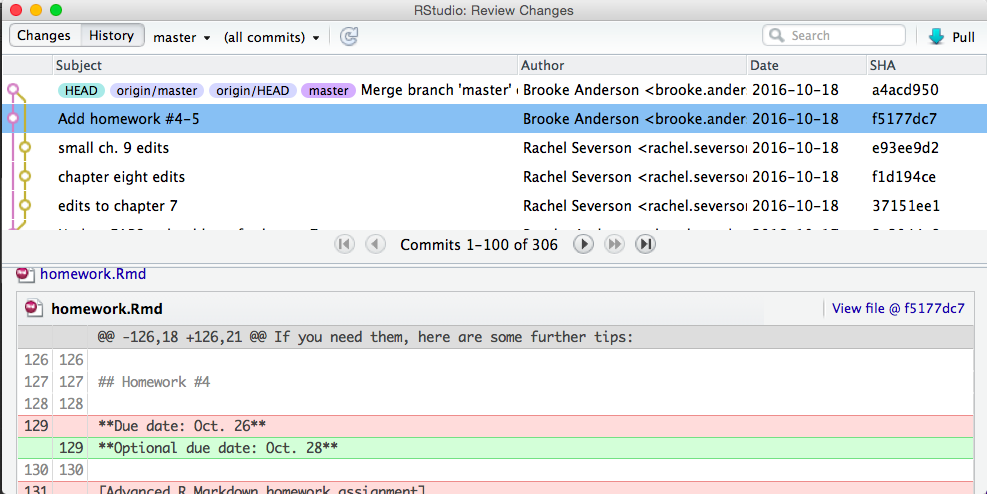

# Open Source Listening

## Overview
You can specify how your R package is licensed in the package DESCRIPTION file under the License: section. How you license your R package is important because it provides a set of constraints for how other R developers use your code. If you’re writing an R package to be used internally in your company then your company may choose to not share the package. In this case licensing your R package is less important since the package belongs to your company. In your package DESCRIPTION you can specify License: file LICENSE, and then create a text file called LICENSE which explains that your company reserves all rights to the package.

However if you (or your company) would like to publicly share your R package you should consider open source licensing. The philosophy of open source revolves around three principles:

1. The source code of the software can be inspected.
2. The source code of the software can be modified.
3. Modified versions of the software can be redistributed.

Nearly all open source licenses provide the protections above. Let’s discuss three of the most popular open source licenses among R packages.


## The General Public License
Known as the GPL, the GNU GPL, and GPL-3, the General Public License was originally written by Richard Stallman. The GPL is known as a copyleft license, meaning that any software that is bundled with or originates from software licensed under the GPL must also be released under the GPL. The exacting meaning of “bundle” will depend a bit on the circumstances. For example, software distributed with an operating system can be licensed under different licenses even if the operating system itself is licensed under the GPL. You can use the GPL-3 as the license for your R package by specifying License: GPL-3 in the DESCRIPTION file.

It is worth noting that R itself is licensed under version 2 of the GPL, or GPL-2, which is an earlier version of this license.


## The MIT License
The MIT license is a more permissive license compared to the GPL. MIT licensed software can be modified or incorporated into software that is not open source. The MIT license protects the copyright holder from legal liability that might be incurred from using the software. When using the MIT license in a R package you should specify License: MIT + file LICENSE in the DESCRIPTION file. You should then add a file called LICENSE to your package which uses the following template exactly:

YEAR: [The current year]
COPYRIGHT HOLDER: [Your name or your organization's name]


## The CC0 License
The [Creative Commons](https://creativecommons.org/) licenses are usually used for artistic and creative works, however the CC0 license is also appropriate for software. The CC0 license dedicates your R package to the public domain, which means that you give up all copyright claims to your R package. The CC0 license allows your software to join other great works like Pride and Prejudice, The Adventures of Huckleberry Finn, and The Scarlet Letter in the public domain. You can use the CC0 license for your R package by specifying License: CC0 in the DESCRIPTION file.


# Why Open Source

## Overview
You’ve put weeks of sweat and mental anguish into writing a new R package, so why should you provide an open source license for software that you or your company owns by default? Let’s discuss a few arguments for why open sourcing your software is a good idea.


## Paying it forward
Software development began in academic settings and the first computer programs with code that could be shared and run on multiple computers was shared between academics in the same way that academics share other kinds of scientific discoveries. The R programming language is open source, and there are hundreds of high-quality R packages that are also open source. A programming language can have lots of exciting features but the continued growth and improvement of a language is made possible by the people contributing to software written in that language. My colleague Amy said it succinctly, "A programming language is only as good as the community"

So with that in mind, if you feel that the R language or the R community has contributed to your success or the success of your company consider open sourcing your software so that the greater R community can benefit from its availability.


## Linus's law
Now let’s turn off the NPR pledge campaign and move our line of thinking from the Berkeley Kumbaya circle to the Stanford MBA classroom: as a business person why should you open source your software? One great reason is a concept called Linus’s Law which refers to Linus Torvalds, the creator of Linux. The Linux operating system is a huge open source software project involving thousands of people. Linux has a reputation for security and for its lack of bugs which is in part a result of so many people looking at and being able to modify the source code. If the users of your software are able to view and modify the source code of your R package your package will likely be improved because of Linus’s Law.


## Hiring
Open source software’s relationship with hiring is a two-way street: if you open source your software and other people send you improvements and contributions you can potentially identify job candidates who you know are already familiar with your source code. On the other hand if you’re looking for a job your contributions to open source software can be a part of a compelling portfolio which showcases your software skills.

However there are pitfalls you should be aware of when weighing a candidate’s open source contributions. Many open source contributions are essentially “free work” - work that a candidate was able to do in their spare time. The best candidates often cannot afford to make open source contributions. The most meaningful ways that an individual contributes to their community usually has nothing to do with writing software.


## Summary
Licensing and copyright laws vary between countries and jurisdictions. You shouldn’t consider any part of this chapter as legal advice. If you have questions about open source licensing software you’re building at work you should consult with your legal department. In most situations software that you write on your own time belongs to you, and software that you write while being paid by somebody else belongs to whoever is paying you. Open source licensing allows you to put restrictions on how your software can be used by others. The open source philosophy does not oppose the commercial sale of software. Many companies offer an open source version of their software that comes with limitations, while also offering a paid license for more expansive commercial use. This business model is used by companies like RStudio and Highcharts.


# Version Control and Github

## Introduction
GitHub allows you to post and interact with online code repositories, where all repositories are under git version control. You can post R packages on GitHub and, with the install_github function from the devtools package, install R packages directly from GitHub. GitHub can be particularly useful for collaborating with others on R packages, as it allows all collaborators to push and pull code between their personal computers and a GitHub repository. While git historically required you to leave R and run git functions at a command line, RStudio now has a number of features that make it easier to interface directly with GitHub.

When using git and GitHub, there are three levels of tasks you’ll need to do:

Initial set-up— these are things you will only need to do once (at least per computer)

- Download git
- Configure git with your user name and email
- Set up a GitHub account
- Set up a SSH key to link RStudio on your personal computer with your GitHub account

Set-up of a specific repository— these are things you will need to do every time you create a new repository, but will only need to do once per repository.

- Initialize the directory on your personal computer as a git repository
- Make an initial commit of files in the repository
- Create an empty GitHub repository
- Add the GitHub repository as a remote branch of the local repository
- Push the local repository to the GitHub remote branch
(If you are starting from a GitHub repository rather than a local repository, either clone the repository or fork and clone the repository instead.)

Day-to-day workflow for a repository— these are things you will do regularly as you develop the code in a repository.

- Commit changes in files in the repository to save git history locally
- Push committed changes to the GitHub remote branch
- Pull the latest version of the GitHub remote branch to incorporate changes from collaborators into the repository code saved on your personal computer
- Write and resolve “Issues” with the code in the repository
- Fix any merge conflicts that come up between different collaborators’ code edits
- If the repository is a fork, keep up-to-date with changes in the upstream branch

Each of these elements are described in detail in this section. More generally, this section describes how to use git and GitHub for version control and collaboration when building R packages.


## Git
Git is a version control system. When a repository is under git version control, information about all changes made, saved, and commited on any non-ignored file in a repository is saved. This allows you to revert back to previous versions of the repository and search through the history for all commits made to any tracked files in the repository. If you are working with others, using git version control allows you to see every change made to the code, who made it, and why (through the commit messages).

You will need git on your computer to create local git repositories that you can sync with GitHub repositories. Like R, git is open source. You can [download](https://git-scm.com/downloads) it for different operating systems.

After downloading git but before you use it, you should configure it. For example, you should make sure it has your name and email address. You can configure git from a bash shell (for Macs, you can use “Terminal”, while for PCs you can use GitBash, which comes with the git installation).

You can use git config functions to configure your version of git. Two changes you should make are to include your name and email address as the user.name and user.email. For example, the following code, if run in a bash shell, would configure a git account for a user named “Jane Doe” who has a generic email address:

git config --global user.name "Jane Doe"
git config --global user.email "jane.doe@university.edu"

Once you’ve installed git, you should restart RStudio so RStudio can identify that git is now available. Often, just restarting RStudio will be enough. However, in some cases, you may need to take some more steps to activate git in RStudio. To do this, go to “RStudio” -> “Preferences” -> “Git/SVN”. Choose “Enable version control”. If RStudio doesn’t automatically find your version of git in the “Git executable” box (you’ll known it hasn’t if that box is blank), browse for your git executable file using the “Browse” button beside that box. If you aren’t sure where your git executable is saved, try opening a bash shell and running which git, which should give you the filepath if you have git installed.


## Intializing a git repository
You can initialize a git repository either using commands from a bash shell or directly from RStudio. First, to initialize a git repository from a bash shell, take the following steps:

- Use a shell (“Terminal” on Macs) to navigate to to that directory. You can use cd to do that (similar to setwd in R).
- Once you are in the directory, first check that it is not already a git repository. To do that, run git status. If you get the message fatal: Not a git repository (or any of the parent directories): .git, it is not yet a git repository. If you do not get an error from git status, the directory is already a repository, so you do not need to initialize it.
- If the directory is not already a git repository, run git init to initialize it as a repository.

For example, if I wanted to make a directory called “example_analysis”, which is a direct subdirectory of my home directory, a git repository, I could open a shell and run:
cd ~/example_analysis
git init

You can also initialize a directory as a git repository for a directory directory through R Studio.

1. Make the directory an R Project. If the directory is an R package, it likely already has an .Rproj file and so is an R Project. If the directory is not an R Project, you can make it one from RStudio by going to “File” -> “New Project” -> “Existing Directory”, and then navigate to the directory you’d like to make an R project.
2. Open the R project.
3. Go to “Tools” -> “Version Control” -> “Project Setup”.
4. In the box for “Version control system”, choose “Git”.

If you do not see “Git” in the box for “Version control system”, it means either that you do not have git installed on your computer or that RStudio was unable to find it. If so, see the earlier instructions for making sure that RStudio has identified the git executable.

Once you initialize the project as a git repository, you should have a “Git” window in one of your RStudio panes (top right pane by default). As you make and save changes to files, they will show up in this window for you to commit. For example, Figure 3.2 is what the Git window for a git repository for writing a coursebook created with bookdown looks like when there are changes to the Week 9 slides that have not yet been commited.


## Committing
When you want git to record changes, you commit the files with the changes. Each time you commit, you have to include a short commit message with some information about the changes. You can make commits from a shell. However, the easiest workflow for an R project, including R packages, is to make git commits directly from the RStudio environment.

To make a commit from RStudio, click on the “Commit” button in the Git window. That will open a separate commit window that looks like Figure 3.3.


In this window, to commit changes:

1. Click on the boxes by the filenames in the top left panel to select the files to commit.
2. If you’d like, you can use the bottom part of the window to look through the changes you are committing in each file.
3. Write a message in the “Commit message” box in the top right panel. Keep the message to one line in this box if you can. If you need to explain more, write a short one-line message, skip a line, and then write a longer explanation.
4. Click on the “Commit” button on the right.

Once you commit changes to files, they will disappear from the Git window until you make and save more changes.


## Browsing history
On the top left of the Commit window, you can toggle to “History”. This window allows you to explore the history of commits for the repository. Figure 3.4 shows an example of this window. The top part of this window lists commits to the repository, from most recent to least. The commit message and author are shown for each commit. If you click on a commit, you can use the bottom panel to look through the changes made to that file with a specific commit.




## Linking local repo to GitHub repo
GitHub allows you to host git repositories online. This allows you to:

- Work collaboratively on a shared repository
- Fork someone else’s repository to create your own copy that you can use and change as you want
- Suggest changes to other people’s repositories through pull requests

To do any of this, you will need a GitHub account. You can sign up at https://github.com. A free account is fine as long as you don’t mind all of your repositories being “Public” (viewable by anyone).

The basic unit for working in GitHub is the repository. A repository is a directory of files with some supplemental files saving some additional information about the directory. While R Projects have this additional information saved as an “.RProj” file, git repositories have this information in a directory called “.git”.

Because this pathname of the .git directory starts with a dot, it won’t show up in many of the ways you list files in a directory. From a bash shell, you can see files that start with . by running ls -a from within that directory.

If you have a local directory that you would like to push to GitHub, these are the steps to do it. First, you need to make sure that the directory is under git version control. See the previous notes on initializing a repository. Next, you need to create an empty repository on GitHub to sync with your local repository. To do that:

1. In GitHub, click on the “+” in the upper right corner (“Create new”).
2. Choose “Create new repository”.
3. Give your repository the same name as the local directory you’d like to connect it to. For example, if you want to connect it to a directory called “example_analysis” on your computer, name the repository “example_analysis”. (It is not required for your GitHub repository name to be identical to your local repository name, but it will make things easier.)
4. Leave everything else as-is (unless you’d like to add a short description in the “Description” box). Click on “Create repository” at the bottom of the page.

Now you are ready to connect the two repositories. First, you should change some settings in RStudio so GitHub will recognize that your computer can be trusted, rather than asking for you password every time. Do this by adding an SSH key from RStudio to your GitHub account with the following steps:

1. In RStudio, go to “RStudio” -> “Preferences” -> “Git / svn”. Choose to “Create RSA key”.
2. Click on “View public key”. Copy everything that shows up.
3. Go to your GitHub account and navigate to “Settings”. Click on “SSH and GPG keys”.
4. Click on “New SSH key”. Name the key something like “mylaptop”. Paste in your public key in the “Key box”.


## Syncing RStudio and GitHub
Now you’re ready to push your local repository to the empty GitHub repository you created.

1. Open a shell and navigate to the directory you want to push. (You can open a shell from RStudio using the gear button in the Git window.)
2. Add the GitHub repository as a remote branch with the following command (this gives an example for adding a GitHub repository named “ex_repo” in my GitHub account, “geanders”):
git remote add origin git@github.com:geanders/ex_repo.git

As a note, when you create a repository in GitHub, GitHub will provide suggested git code for adding the GitHub repository as the “origin” remote branch to a repository. That code is similar to the code shown above, but it uses “https://github.com” rather than "git@github.com"; the latter tends to work better with RStudio.

Push the contents of the local repository to the GitHub repository.
git push -u origin master

To pull a repository that already exists on GitHub and to which you have access (or that you’ve forked and so have access to the forked branch), first use cd from a bash shell on your personal computer to move into the directory where you want to put the repository. Then, use the git clone function to clone the repository locally. For example, to clone a GitHub repository called “ex_repo” posted in a GitHub account with the user name janedoe, you could run:
git clone git@github.com:janedoe/ex_repo.git

Once you have linked a local R project with a GitHub repository, you can push and pull commits using the blue down arrow (pull from GitHub) and green up arrow (push to GitHub) in the Git window in RStudio (see Figure 3.2 to see examples of these arrows).

GitHub helps you work with others on code. There are two main ways you can do this:

- Collaborating: Different people have the ability to push and pull directly to and from the same repository. When one person pushes a change to the repository, other collaborators can immediately get the changes by pulling the latest GitHub commits to their local repository.
- Forking: Different people have their own GitHub repositories, with each linked to their own local repository. When a person pushes changes to GitHub, it only makes changes to his own repository. The person must issue a pull request to another person’s fork of the repository to share the changes.


## Issues
Each original GitHub repository (i.e., not a fork of another repository) has a tab for “Issues”. This page works like a Discussion Forum. You can create new “Issue” threads to describe and discuss things that you want to change about the repository.

Issues can be closed once the problem has been resolved. You can close issues on the “Issue” page with the “Close issue” button. If a commit you make in RStudio closes an issue, you can automatically close the issue on GitHub by including “Close #[issue number]” in your commit message and then pushing to GitHub. For example, if issue #5 is “Fix typo in section 3”, and you make a change to fix that typo, you could make and save the change locally, commit that change with the commit message “Close #5”, and then push to GitHub, and issue #5 in “Issues” for that GitHub repository will automatically be closed, with a link to the commit that fixed the issue.


## Pull request
You can use a pull request to suggest changes to a repository that you do not own or otherwise have the permission to directly change. Take the following steps to suggest changes to someone else’s repository:

- Fork the repository
- Make changes (locally or on GitHub)
- Save your changes and commit them
- Submit a pull request to the original repository
- If there are not any conflicts and the owner of the original repository likes your changes, he or she can merge them directly into the original repository. If there are conflicts, these need to be resolved before the pull request can be merged.

You can also use pull requests within your own repositories. Some people will create a pull request every time they have a big issue they want to fix in one of their repositories.

In GitHub, each repository has a “Pull requests” tab where you can manage pull requests (submit a pull request to another fork or merge in someone else’s pull request for your fork).


## Mergbe conflicts
At some point, if you are using GitHub to collaborate on code, you will get merge conflicts. These happen when two people have changed the same piece of code in two different ways at the same time.

For example, say two people are both working on local versions of the same repository, and the first person changes a line to mtcars[1, ] while the second person changes the same line to head(mtcars, 1). The second person pushes his commits to the GitHub version of the repository before the first person does. Now, when the first person pulls the latest commits to the GitHub repository, he will have a merge conflict for this line. To be able to commit a final version, the first person will need to decide which version of the code to use and commit a version of the file with that code.

If there are merge conflicts, they’ll show up like this in the file:

<<<<<<< HEAD
mtcars[1, ]
=======
head(mtcars, 1)
>>>>>>> remote-branch

To fix them, search for all these spots in files with conflicts (Ctrl-F can be useful for this), pick the code you want to use, and delete everything else. For the example conflict, it could be resolved by changing the file from this:
<<<<<<< HEAD
mtcars[1, ]
=======
head(mtcars, 1)
>>>>>>> remote-branch

To this:
head(mtcars, 1)

That merge conflict is now resolved. Once you resolve all merge conflicts in all files in the repository, you can save and commit the files.

These merge conflicts can come up in a few situations:
- You pull in commits from the GitHub branch of a repository you’ve been working on locally.
- Someone sends a pull request for one of your repositories, and you have updated some of the code between when the person forked the repository and submitted the pull request.


# Software Design and Philosophy

## Introduction
Writing and designing software is a creative endeavour and like in other creative arts there are styles are guidelines that you can follow, however revolutions in the field can occur when those dogmas are broken properly. We’re going to cover a few of the prominent ideas in software design in the last century. Above all of these suggestions I suggest one cardinal rule: Have empathy for your fellow human beings. Software is inherently complex, so set up your users to [fall into a pit of success](https://blogs.msdn.microsoft.com/brada/2003/10/02/the-pit-of-success/).


## The Unix philosophy
The R programming language is open source software and many open source software packages draw some inspiration from the design of the Unix operating system which macOS and Linux are based on. [Ken Thompson](https://en.wikipedia.org/wiki/Ken_Thompson) - one of the designers of Unix - first laid out this philosophy, and many Unix philosophy principles can be applied to R programs. The overarching philosophical theme of Unix programs is to do one thing well. Sticking to this rule accomplishes several objectives:

1. Since your program only does one thing the chance that your program contains many lines of code is reduced. This means that other’s can more easily read the code for your program so they can understand exactly how it works (if they need to know).
2. Simplicity in your program reduces the chance there will be major bugs in your program since fewer lines of code means fewer opportunities to make a mistake.
3. Your program will be easier for users to understand since the number of inputs and outputs are reduced for a program that only does one thing.
4. Programs built with other small programs have a higher chance of also being small. This ability to string several small programs together to make a more complex (but also small) program is called composability.

Unix command line programs are notable for their use of the pipe operator (|) and so the Unix philosophy also encourages programs to produce outputs that can be piped into program inputs. Recently pipes in R have surged in popularity thanks to projects like the magrittr package. When it makes sense for your function to take data (usually a vector or a data frame) as an argument and then return data, you should consider making the data argument the first argument in your function so that your function can be part of a data pipeline.

One case where many R programs differ from the greater Unix philosophy is in terms of user interaction. Unix programs will usually only print a message to the user if a program produces an error or warning. Although this is a good guideline for your programs, many R programs print messages to the console even if the program works correctly. Many R users only use the language interactively, so showing messages to your users might make sense for your package. One issue with messages is that they produce output which is separate from the results of your program, and therefore messages are harder to capture.


## Default values
Every function argument is an opportunity for your function to fail the user by producing an error because of bad or unexpected inputs. Therefore you should provide as many default values for your functions as is reasonable. If there’s an argument in your function that should only be one of a handful of values you should use the match.arg() function to check that one of the permitted values is provided:

```{r eval=FALSE}
multiply_by <- function(n, multiplier = c("two", "three", "four")){
  multiplier <- match.arg(multiplier)
  if(multiplier == "two"){
    n * 2
  } else if(multiplier == "three"){
    n * 3
  } else {
    n * 4
  }
}

multiply_by(5, "two")
multiply_by <- function(n, multiplier = c("two", "three", "four")){
  multiplier <- match.arg(multiplier)
  if(multiplier == "two"){
    n * 2
  } else if(multiplier == "three"){
    n * 3
  } else {
    n * 4
  }
}

multiply_by(5, "two")
[1] 10
multiply_by(5, "six")
Error in match.arg(multiplier): 'arg' should be one of "two", "three", "four"
multiply_by(5, "six")
Error in match.arg(multiplier): 'arg' should be one of "two", "three", "four"

```

Using match.arg() ensures that an error is thrown immediately if an erroneous argument value is provided.


## Naming things
Naming functions and variables is a challenge that programmers have always struggled with. Here are a few strategies you should use when naming things in R:

1. Use snake case and lowercase. Modern R packages use function and variable names like geom_line(), bind_rows(), and unnest_token() where words are separated by underscores (_) and all characters are lowercase. Once upon a time words were commonly separated by periods (.) but that scheme can cause confusion with regard to generic functions (see the object oriented programming chapter for more information).
2. Names should be short. A short name is faster to type and is more memorable than a long and complicated name. The length of a variable name has to be balanced with the fact that:
3. Names should be meaningful and descriptive. Function names should generally describe the actions they perform. Other object names should describe the data or attributes they encompass. In general you should avoid numbering variable names like apple1, apple2, and apple3. Instead you should create a data structure called apples so you can access each apple with apple[[1]], apple[[2]], and apple[[3]].
4. Be sure that you’re not assigning names that already exist and are common in R. For example mean, summary, and rt are already names of functions in R, so try to avoid overwriting them. You can check if a name is taken using the apropos() function:

```{r}
apropos("mean")
apropos("my_new_function")
```

You might want to consider grouping similar functions together in families which all start with the same short prefix. For example in the ggplot2 package the aes_ family of functions set graphing aesthetics, the gs_ family of functions interact with the Google Sheets API in the googlesheets package, and the wq_ family of functions all write questions in the swirlify package.


## Playing well with others
If you write a package with useful functions that are well designed then you may be lucky enough that your package becomes popular! Others may build upon your functions to extend or adapt thier features for other purposes. This means that when you establish a set of arguments for a function you’re implicitly promising some amount of stability for the inputs and outputs of that function. Changing the order or the nature of function arguments or return values can break other people’s code, creating work and causing pain for those who have chosen to use your software. For this reason you should think very carefully about function arguments and outputs to ensure that both can grow and change sustainably. You should seek to strike a balance between frustrating your users by making breaking changes and ensuring that your package follows up to date programming patterns and ideas. If you believe that the functions in a package you’re developing are not yet stable you should make users aware of that fact so that they’re warned if they choose to build on your work.


## Summary
Most of software design is ensuring that your users stumble into their desired outcome. You may think you’re writing the most intuitive package, but sitting down with a colleague and watching them use your package can teach you volumes about what users want and expect out of your package. There are libraries full of books written about software design and this chapter is only meant to serve as a jumping off point. If you happen to be looking for inspiration I highly recommend this talk Bret Victor called: [The Future of Programming](http://worrydream.com/dbx/).